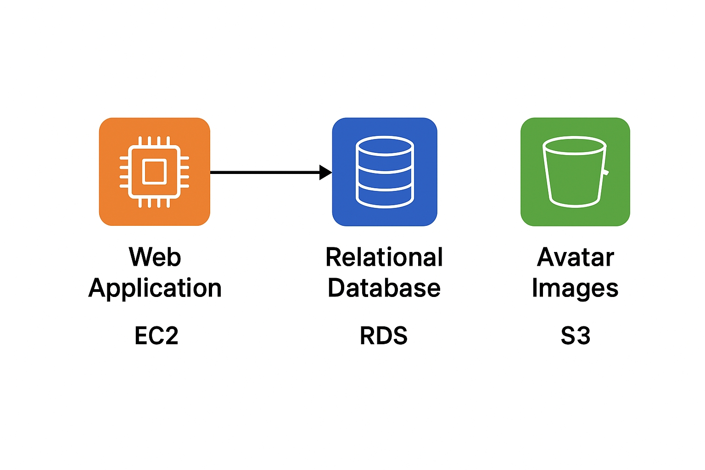

# Despliegue de aplicación Laravel CRUD de alumnos en AWS

Este proyecto es un ejemplo sencillo de una aplicación **Laravel** (CRUD de alumnos) desplegada en **AWS** usando:
- **EC2** como servidor web
- **RDS (MySQL)** como base de datos
- **S3** (opcional, para almacenamiento de archivos, no utilizado en este ejemplo por restricciones de AWS Academy)

---

## Infraestructura
- **EC2** (Ubuntu 22.04 LTS)
- **RDS** (MySQL 8.x)
- **Security Groups** abiertos en:
    - Puerto **22** (SSH)
    - Puerto **80** (HTTP)
    - Puerto **443** (HTTPS, opcional)
---

## Instalación paso a paso en EC2

### 1. Actualizar el sistema
```bash
sudo apt update && sudo apt upgrade -y
```

### 2. Instalar Apache, PHP y módulos requeridos por Laravel
```bash 
sudo apt install -y apache2 php libapache2-mod-php \
    php-mbstring php-xml php-bcmath php-zip php-mysql \
    unzip curl git composer
```    
3. Instalar Node.js y npm
```bash 
sudo apt install -y nodejs npm
```
4. Configurar el DocumentRoot de Apache
Editar el archivo del VirtualHost:

``` bash
sudo nano /etc/apache2/sites-available/000-default.conf
```


Modificar la línea:
``` bash
DocumentRoot /var/www/html/proyecto_laravel/public
```

Reiniciar Apache:

```bash
sudo systemctl restart apache2
```
5. Clonar el proyecto en el servidor
```bash
cd /var/www/html
sudo git clone <URL_REPOSITORIO> proyecto_laravel
```
6. Permisos de escritura para Laravel
```bash
sudo chown -R www-data:www-data /var/www/html/proyecto_laravel
sudo chmod -R 775 /var/www/html/proyecto_laravel/storage
sudo chmod -R 775 /var/www/html/proyecto_laravel/bootstrap/cache
```
7. Instalar dependencias
```bash
cd /var/www/html/proyecto_laravel
composer update
npm install
npm run build
```
8. Configuración de variables de entorno
```bash
cp .env.example .env
nano .env
```

```bash
APP_KEY=   # se generará más adelante
DB_CONNECTION=mysql
DB_HOST=<ENDPOINT_RDS>
DB_PORT=3306
DB_DATABASE=<NOMBRE_BD>
DB_USERNAME=<USUARIO>
DB_PASSWORD=<PASSWORD>
```

Generar la APP_KEY:

```bash
php artisan key:generate
```
9. Migraciones y seeders
```bash
php artisan migrate --seed
````
##  Acceso
Una vez desplegado, la aplicación estará disponible en:

```bash
http://<IP_PUBLICA_EC2>/
```
> Notas
>> * S3 no se ha configurado en este ejemplo debido a restricciones de AWS Academy.

>> *Revisar que el Security Group de la EC2 permita tráfico en puerto 80.

>> Revisar que la EC2 tenga acceso a la RDS (abrir puerto 3306 en el SG de la RDS).


---

## 🖥️ Script de arranque (User Data para EC2)

Este script lo puedes pegar directamente en la **configuración de User Data** al lanzar la EC2 (Ubuntu 22.04).  

```bash
#!/bin/bash
# Actualizar sistema
apt update && apt upgrade -y

# Instalar Apache, PHP y módulos Laravel
apt install -y apache2 php libapache2-mod-php \
    php-mbstring php-xml php-bcmath php-zip php-mysql \
    unzip curl git composer nodejs npm

# Habilitar Apache al inicio
systemctl enable apache2
systemctl start apache2

# Descargar proyecto (ajusta con tu repo)
cd /var/www/html
git clone https://github.com/usuario/proyecto_laravel.git proyecto_laravel

# Configurar DocumentRoot
sed -i 's|/var/www/html|/var/www/html/proyecto_laravel/public|g' /etc/apache2/sites-available/000-default.conf
systemctl restart apache2

# Permisos de Laravel
chown -R www-data:www-data /var/www/html/proyecto_laravel
chmod -R 775 /var/www/html/proyecto_laravel/storage
chmod -R 775 /var/www/html/proyecto_laravel/bootstrap/cache

# Instalar dependencias
cd /var/www/html/proyecto_laravel
composer install
npm install
npm run build

# Configurar .env (ejemplo, mejor hacerlo manual luego)
cp .env.example .env

# Generar APP_KEY
php artisan key:generate 
